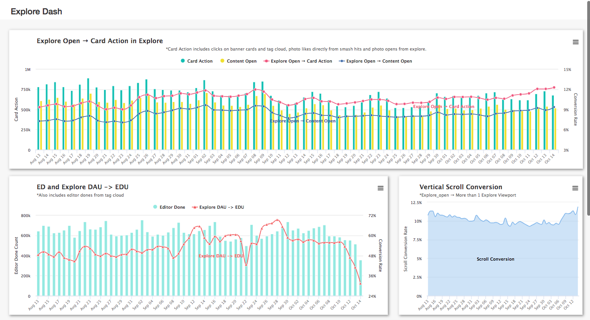
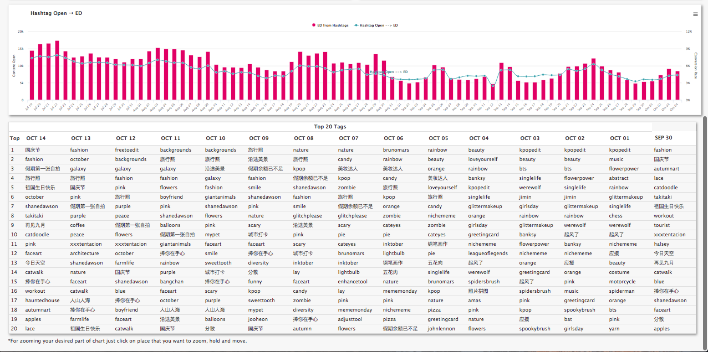
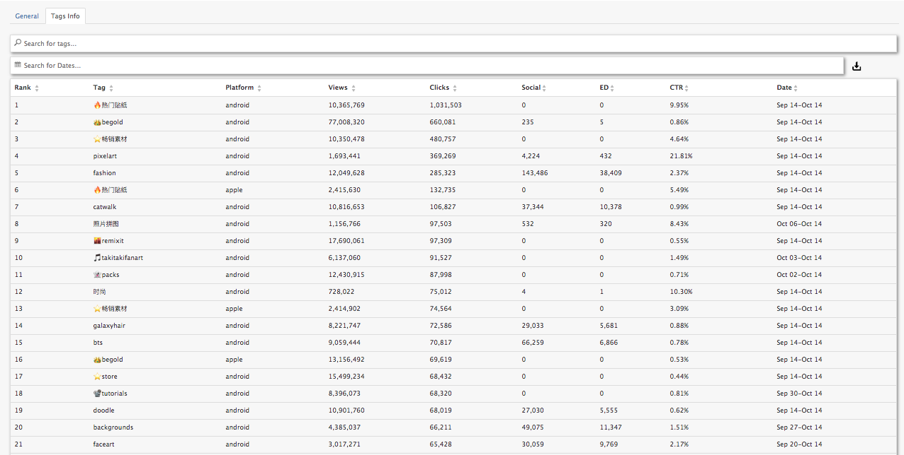
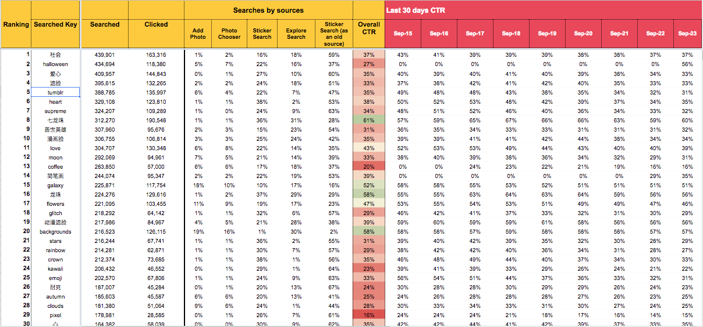

# Dashboards
You can find here dashboard screenshots and code samples made by me.

Automated data filling was done using <b> spark/scala +  jenkins + pg db </b>

 PHP used for backend.

<h3> Web Tool using highcharts.js </h3>

<h3> Automated Report using google sheets </h3>

